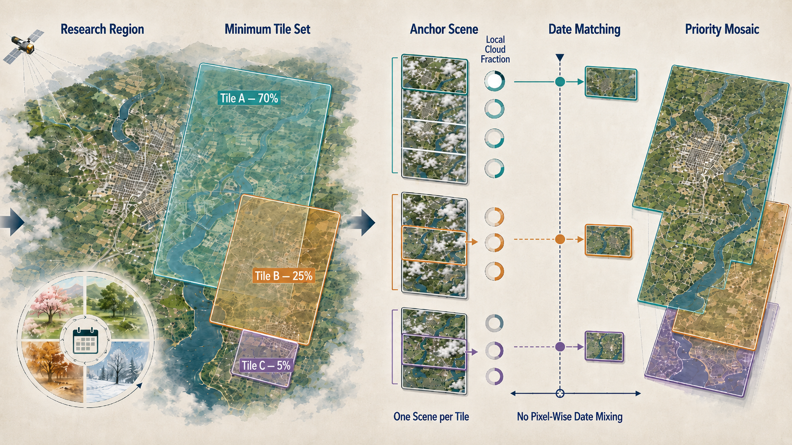

<p align="center">
  <h1 align="center">GEE Tile Temporal Mosaic Skill</h1>
</p>

<p align="center">
  <a href="README_CN.md">中文说明</a>
</p>

<p align="center">
  
</p>

Google Earth Engine skill for building a spatially complete, low-cloud ROI
mosaic from the fewest required Sentinel-2 or Landsat tiles while keeping each
tile tied to one selected acquisition.

This package is designed for OpenAI Codex and Claude Code. It is a workflow
skill, not a generic `qualityMosaic` recipe: it selects tiles and scenes at the
image level, coordinates dates across tiles, and uses fixed-priority overlap
handling.

## What It Solves

The skill is intended for requests such as:

- “My city spans three Sentinel-2 MGRS tiles. Find the minimum tile set and make
  one low-cloud mosaic for May-September 2019-2023.”
- “Use one scene per tile, keep the extra tiles within five days of the anchor,
  and calculate cloud fraction inside my ROI rather than using scene metadata.”
- “Let the largest-coverage tile anchor the search, but evaluate several anchor
  candidates because the anchor date changes the other tile choices.”

It deliberately avoids silently mixing arbitrary dates per pixel. The default
output is a `priority_mosaic`: one selected image per required tile, with the
largest-contribution tile above lower-priority tiles. A lower tile can fill an
upper tile's masked gap, but cannot replace a valid upper-tile pixel.

## Compatibility

- OpenAI Codex: install the repository as a skill folder under `~/.codex/skills`.
- Claude Code: install the same repository under `~/.claude/skills`.
- GEE Code Editor JavaScript and Earth Engine Python API/geemap are both
  supported. Choose the language per task.

The package contains instructions and reference templates. Earth Engine access,
authentication, a Cloud Project ID, and an ROI are supplied by the user at run
time; no credentials or private assets are bundled.

## Installation

### OpenAI Codex

```bash
git clone https://github.com/NightSensingLab/gee-tile-temporal-mosaic.git \
  ~/.codex/skills/gee-tile-temporal-mosaic
```

Invoke it explicitly with:

```text
$gee-tile-temporal-mosaic
```

### Claude Code

```bash
git clone https://github.com/NightSensingLab/gee-tile-temporal-mosaic.git \
  ~/.claude/skills/gee-tile-temporal-mosaic
```

Install the complete repository. The root `SKILL.md`, `agents/openai.yaml`, and
`references/` files are all part of the skill package.

## Method In Brief

1. Determine the minimum geometric tile set using incremental ROI coverage,
   not the sum of overlapping tile areas.
2. Compute ROI-local cloud, clear, shadow, and footprint metrics for candidate
   scenes.
3. Keep several anchor-scene candidates and evaluate coupled tile/date
   combinations instead of fixing the lowest-cloud anchor greedily.
4. Apply hard thresholds and date-gap constraints, then rank final combinations
   by visible clear coverage, masked gaps, temporal spread, and target-date
   distance.
5. Assemble the chosen images in explicit tile priority order and report the
   selected scene/date and quality diagnostics for every tile.

The skill does not use `qualityMosaic` or a cross-date `median` by default.
If no acceptable combination exists, it returns an explicit incomplete or
no-solution state rather than silently expanding the time window.

## Repository Layout

```text
SKILL.md                         Core instructions and guardrails
agents/openai.yaml               Codex UI metadata
references/selection-design.md   Set cover, candidate search, scoring, overlap
references/sentinel2-javascript.md
                                 Sentinel-2 Code Editor pattern
references/python-geemap.md      Python/geemap pattern
references/landsat.md            Landsat Collection 2 masking notes
examples/                        Realistic prompts and expected diagnostics
```

## Prompt Examples

### Three-tile seasonal Sentinel-2 mosaic

```text
Use $gee-tile-temporal-mosaic. My ROI spans three Sentinel-2 MGRS tiles.
Search 2019-2023 May-September. Require anchor local cloud <= 3%, other-tile
local cloud <= 20%, and a maximum five-day gap from the anchor. Keep one scene
per tile, evaluate several anchor candidates, use priority_mosaic, and output
GEE Code Editor JavaScript. Print tile dates, local cloud fractions, final
clear coverage, masked-gap fraction, and fallback state. Do not use
qualityMosaic or cross-date median.
```

### Python/geemap output

```text
Use $gee-tile-temporal-mosaic in Python/geemap mode. Preserve the same tile
selection, local cloud metrics, date-gap constraint, and overlap semantics.
Initialize Earth Engine with PROJECT_ID, keep server-side reducers, and make
Drive export opt-in.
```

### Strict temporal ownership

```text
Use $gee-tile-temporal-mosaic with overlapMode=exclusive_tile. No lower-priority
tile may fill a masked gap in another tile. Return an incomplete masked result
when a selected tile is cloudy.
```

## Important Limitations

- A five-year May-September search with one final output is a global best
  seasonal mosaic, not a representative result for each year.
- `priority_mosaic` can expose a lower tile in an upper tile's masked gap; the
  per-tile date difference is therefore reported explicitly.
- Exact candidate-combination search grows quickly with tile count. Use a small
  `topN` or a bounded beam search for large tile sets and state the approximation.
- Local cloud metrics depend on the chosen cloud-probability and scene-class
  thresholds. Snow, bright roofs, haze, and cloud shadow require study-specific
  review.

## License

The original skill files are released under the MIT License. Dataset terms and
Earth Engine collection terms remain governed by their respective providers;
see [THIRD_PARTY_NOTICES.md](THIRD_PARTY_NOTICES.md).
